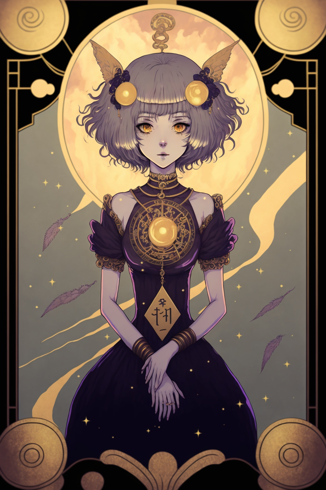

# Fortune Contracts

ERC20 contract for Fortune tokens of [Saturn Series](https://saturnseries.com).

  

--

##  Overview
The system implements one ERC20 token called FORTUNE
The token can be minted with a cooldown of one token per day
The token is transferrable
The FORTUNE can be burned to emit an event of GOOD and BAD fortunes.
There is no cooldown to burn fortunes.

The FORTUNE tokens have unlimited supply, but can only be minted by Saturn Series Legend NFT holders

The output of good or bad has been naively randomized, it uses a mix of `block.prevrandao`, `block.timestamp`, and the optional gwei sent as a tribute (`msg.value`) to calculate if the event is GOOD or BAD.

The challenge of the game consists on using any means possible (MEV) to get as many GOOD fortune events emited for burning the FORTUNE tokens.

# Getting Started
Create the environment
`python3 -m venv`

Activate the environmante
`source venv/bin/activate`

Change directories
`cd contracts`

# Test
`ape test`

# Compile
`ape plugins install vyper`
`ape compile`
